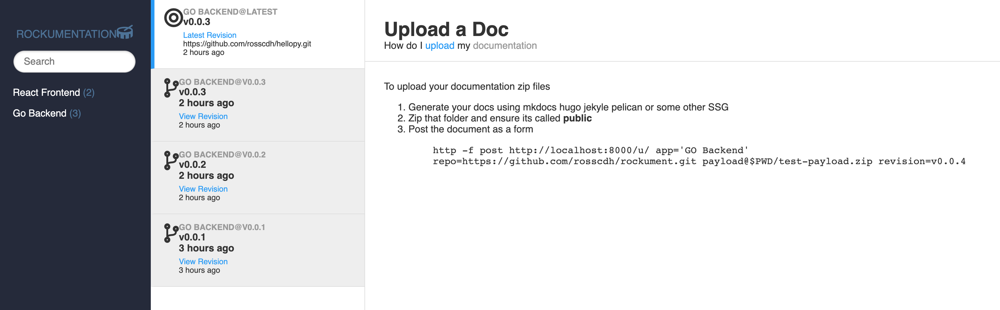

# Rockument

Simple document host system similar to hostthedocs or gitlab pages



```
docker-compose up
docker-compose exec rockument python manage.py migrate
docker-compose exec rockument python manage.py createsuperuser
http -f post http://localhost:8000/u/ app=test repo=https://github.com/rosscdh/rockument.git payload@$PWD/test-payload.zip revision=v0.0.4
opne localhost:8000/v/test/
opne localhost:8000/v/test/latest/
opne localhost:8000/v/test/v0.0.4/
```

### Uses

* django
* redis
* vuejs
* elasticsearch